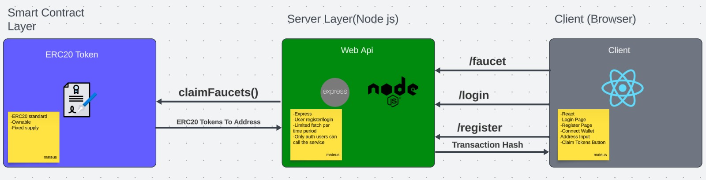

# ERC20 Faucet
Esse projeto é um faucet de tokens ERC20, que permite que usuários solicitem tokens de teste para suas carteiras cadastradas ou sua carteiras Metamask.

## Tecnologias utilizadas

**Client:** React, Material UI, Vite

**Server:** Node, Express,Typescript, Ethers JS

**Blockchain**: Solidity, Hardhat, Typescript

## Documentação para cada camada de projeto

 - [Camada de blockchain com Hardhat AQUI](./smart-contract/README.md)
 - [Camada de Servidor com Node e Express AQUI](./server/README.md)
 - [Camada de Cliente com React](./client/README.md)